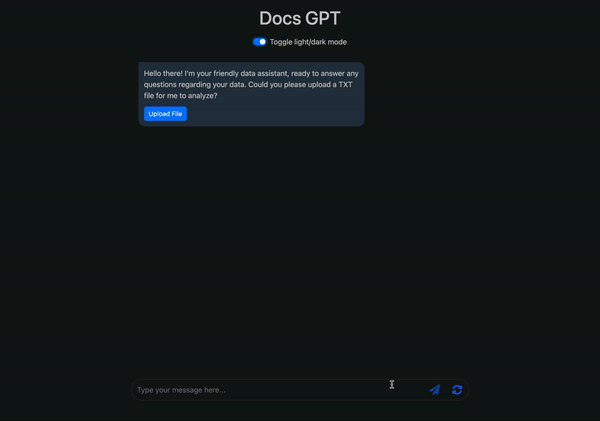

## DocGPT
Extend the knowledge of your LLM with TXT document. Upload any TXT and start asking questions related to that TXT file. Using this project you can train your LLM to any new data and then ask questions related to that. LLM would be able to fetch insights or answers from that document and make meaning ful answers from that.

### How to run

#### Environment
1. Create `.env` file in root.

`
OPENAI_API_KEY="OPEN-AI-KEY"
`

#### Downloading libraries
1. Set up new virtual environment.
`python3 -m venv .venv`
2. Activate virtual environment.
`source .venv/bin/activate`
3. Download all required dependencies.
`pip -r requirements.txt`

#### Running project

`python3 server.py`

#### 🚨 Important
1. This project uses OPEN AI as LLM model , so calling its api would cost you money.

### Demo:

### Working details
https://shivamreloaded.com/ai/2023/09/06/custom-qa-bot.html

